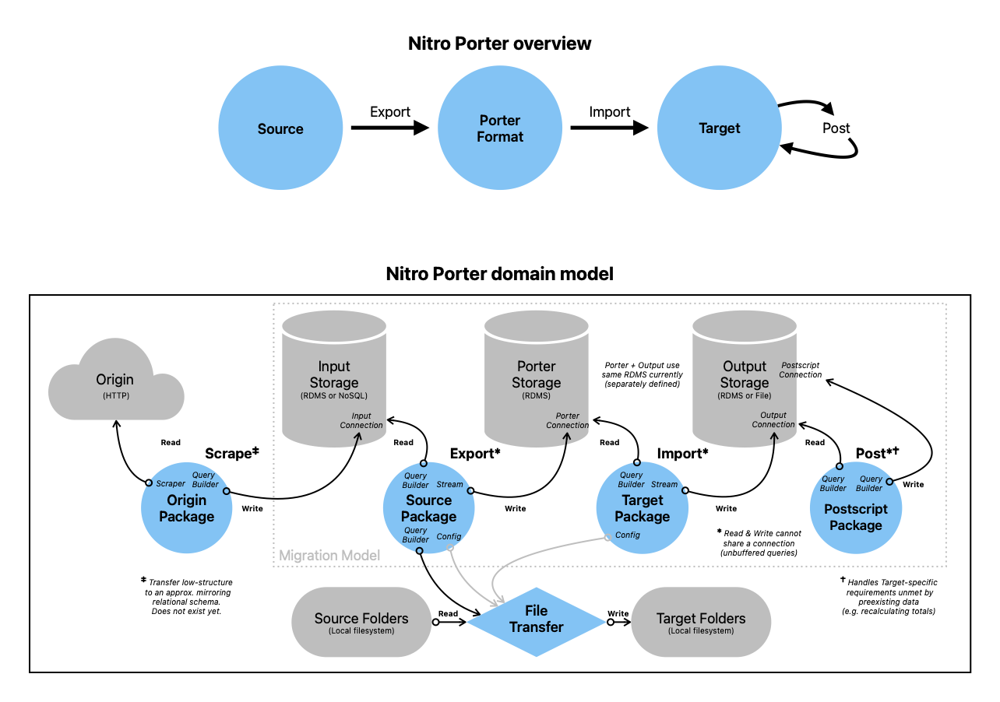

# Domain Guide

As we move to a domain-driven model, these are core terms to help you understand the application.

## Primary Domain Terms

Ordered logically to build a baseline understanding of the domain.

<dt>Package</dt>
<dd>A file containing a migration definition.</dd>

<dt>Source</dt>
<dd>A package for the software we are exporting (leaving).</dd>

<dt>Target</dt>
<dd>A package for the software we are importing (moving to).</dd>

<dt>Storage</dt>
<dd>A category of data source engine, like a database.</dd>

<dt>Connection</dt>
<dd>The access credentials and address of a data source OR the active connection to one.</dd>

<dt>Porter [Format|Storage]</dt>
<dd>Nitro Porter's intermediary data format that sits between the Source and Target.</dd>

<dt>Export</dt>
<dd>Transferring data from its Source Storage to Porter Storage.</dd>

<dt>Import</dt>
<dd>Transferring data from Porter Storage to its Target Storage.</dd>

<dt>Input</dt>
<dd>The read-only data storage/connection for an Export or Import that contains/accesses
the origin data being read (defined by a Source or Porter).</dd>

<dt>Output</dt>
<dd>The write-enabled data storage/connection for an Export or Import that contains/accesses
the transformed data being written (defined by Porter or a Target).</dd>

<dt>Postscript</dt>
<dd>Package of "build" steps to calculate data required by (but not Imported to) the Target platform.</dd>

<dt>Request</dt>
<dd>A generic set of instructions for any migration (or subset thereof).</dd>

<dt>Migration</dt>
<dd>Fulfills a Request to transform & transfer data using an Export, Import, & Postscript (or any subset thereof).
(May also refer to a "database schema migration", an industry term for altering database schema in a reversible way 
using coded definitions, done with the library `Phinx` in Nitro Porter's automated tests.)</dd>

## Domain Diagram

## Porter Format Terms

Because every platform uses its own nomenclature, it's important to standardize within Nitro Porter for clarity.
We use terms adopted by Vanilla Forums, the database structure Porter Format is based on. **Bold** items are considered 'core' data that all packages should support if possible.

### User data

- **Users**: Anyone who logs in.
- **Roles**: Users may be assigned one or more.
- Avatars: User image.
- Badges: User awards.
- Ranks: Hierarchical pseudo-roles, typically automated.
- Bookmarks: Discussions a user has saved for later.

### Content

- **Discussions**: A thread or topic of discussion.
- **Comments**: Responses in a Discussion.
- **Categories**: Hierarchy of discussion topics or areas.
- Tags: Non-hierarchical labels for discussions.
- Reactions: Emoji / image-based click-replies.
- Attachments: Files associated with a discussion or comment.
- Polls: Survey question that users may vote on.
- Private Messages: A private conversation separate from discussions, aka "Direct Message (DM)".
- User Wall: Shared content associated with a single user's profile.
- User Notes: Private content associated with a user, usually by an admin.

## Secondary Domain Terms & Tech Glossary

Ordered alphabetically for reference.

<dt>Bundle</dt>
<dd>Manages a Parser for the library `s9e\TextFormatter`.</dd>

<dt>Command</dt>
<dd>A instructions sent via Command Line Interface (CLI) to be converted to a Request.</dd>

<dt>Config</dt>
<dd>An entity managing the application configuration, derived from `config.php` (or `config-sample.php`).
The Config may supplement a Command with additional information when building a Request.</dd>

<dt>Connection Manager</dt>
<dd>Manages a data Connection based on the library `Illuminate\Database`.</dd>

<dt>E2E</dt>
<dd>"End-To-End", a type of automated testing the covers the entire request lifecycle (input to output). 
In most Web apps, this means testing HTML or Javascript-based interactions.
In Nitro Porter, this is executing a full migration request (including CLI output & logging).</dd>

<dt>ETL</dt>
<dd>"Extract, Transform, & Load", the sequence of a typical data pipeline.
I believe its connotation is reductive in the context of user-generated content,
but you could think of Porter as "composable ETLs in a tailored trenchcoat" if it's helpful.</dd>

<dt>Filter</dt>
<dd>Used in Packages to transform individual data values mid-migration.</dd>

<dt>Map</dt>
<dd>Used in Packages to assign values between keys (Source to Porter, or Porter to Target).</dd>

<dt>Parser</dt>
<dd>Custom formatting instructions for the library `s9e\TextFormatter`.</dd>

<dt>Seed</dt>
<dd>Mock data for an automated test.</dd>

<dt>Structure</dt>
<dd>A data structure, like a database table schema (or an entire database), including its constraints
(like types, size, keys, and not-null flags).</dd>

<dt>UGC</dt>
<dd>"User-Generated Content" is anything a non-admin user has created, like the content of a post.</dd>
